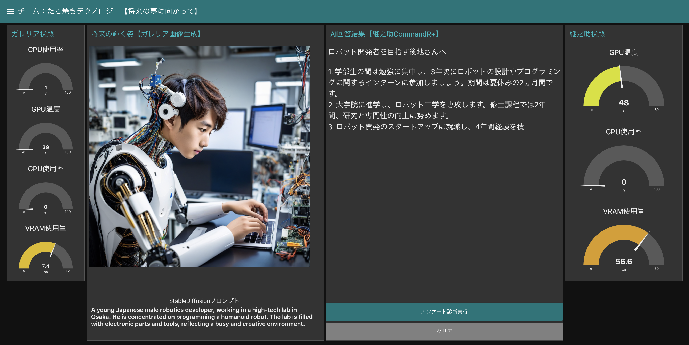
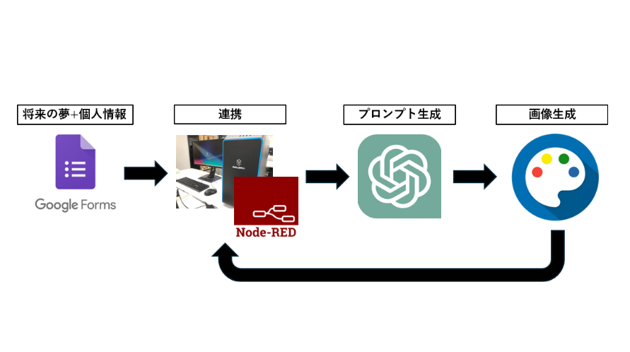
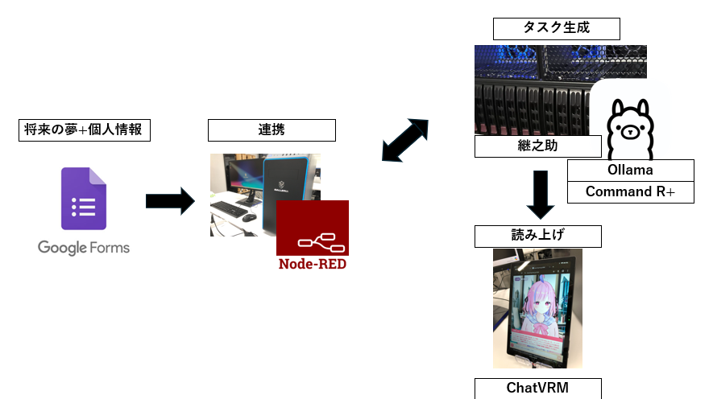
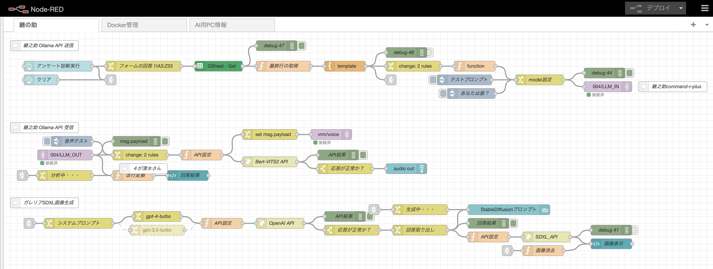
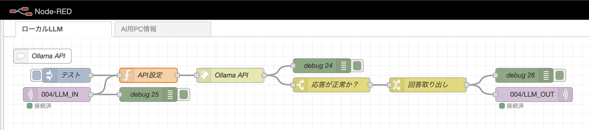

# 24aihack_Team_Takoyaki
24aihackで作成したNode-REDフローです。各機能の連携にNode-REDを使用しています。
## 概要
作品名は「夢コンサルタント」です。
グーグルフォームにて将来の夢と個人情報（名前や住んでいる国、趣味、特技など）を入力してもらいます。
その情報をもとに夢を叶えた姿の画像と夢を達成するためのプロセス（タスク）を提案します。
## 出力例

## システム概要

### システム概要-画像生成
将来の夢と個人情報をもとにSDXLで画像生成を行います。この時、プロンプトをGPT-4に考えてもらいます。

### システム概要-タスク生成
将来の夢と個人情報をもとにCommandR+でタスクの生成を行います。その後ChatVRMにテキストを送信、読み上げを行います。

## GALLERIAフロー

## 継之助フロー

