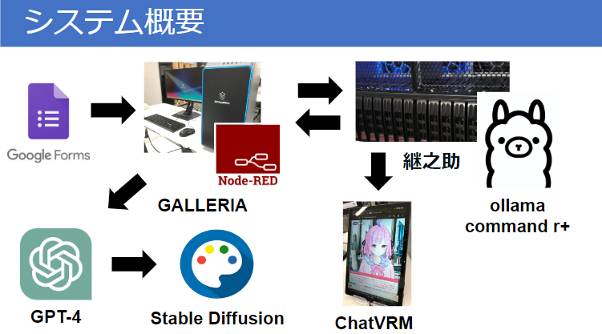

# 24aihack_Team_Takoyaki
24aihackで作成したNode-REDフローです。
## 概要
グーグルフォームにて将来の夢と個人情報（名前や住んでいる国、趣味、特技など）を入力してもらいます。
その情報をもとに夢を叶えた姿の画像と夢を達成するためのプロセス（タスク）を提案します。
## 出力例

## システム概要

## 画像生成

## プロセス提案

## GALLERIAフロー

## 継之助フロー

